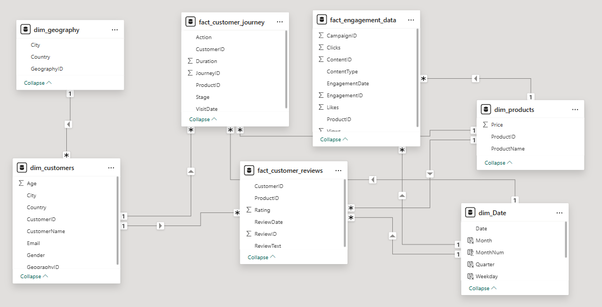
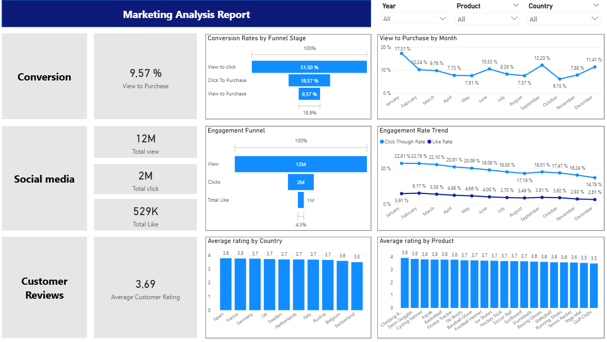

**Marketing Analytics Project**

**1. Project Background:**

The marketing team has observed declining engagement and conversion performance despite increasing investment in marketing campaigns. Although campaigns generate a large number of views and clicks, the return in terms of purchases is not meeting expectations.

To better understand the situation, the marketing team requested a data analysis to evaluate the effectiveness of current marketing strategies. The available data includes customer journey interactions, marketing engagement metrics, product information, and customer reviews.

The goal of this project is to analyze these datasets to identify patterns in customer behavior, engagement performance, and satisfaction levels in order to uncover opportunities to improve marketing effectiveness and conversion outcomes.

**Main business Problem:**

Marketing campaigns generate high traffic but relatively low conversion into purchases.

**Key Question:**

What insights can help improve marketing effectiveness and increase conversion performance?

**2. SQL Data Preparation**

Before building the dashboard, the raw datasets were cleaned and transformed using SQL Server. 

**2.1 Dimension Table Data**

- [Product Data](01_products_cleaning.sql)
- [Customer Data](02_customers_cleaning.sql)

**2.2 Fact Table Data**

- [Customer Journey](03_customerjourney_cleaning.sql)
- [Customer Engagement](05_engagement_cleaning.sql)
- [Customer Reviews](04_customerreview_cleaning.sql)

**3. Power BI Dashboards:**

**3.1. Data Models:**

The dataset was structured using a star schema data model to enable efficient analysis.

**3.2. Overview Dashboards:**

**Conversion Rate**

The marketing funnel shows a significant drop in conversion across stages.

View → Click rate: 51.5%

Click → Purchase rate: 18.6%

Overall View → Purchase conversion: 9.57%

This indicates that while marketing campaigns successfully drive traffic, a large portion of interested users do not convert into customers.
The biggest drop occurs between Click and Purchase, suggesting possible friction in the purchase process such as pricing perception, product page experience, or checkout barriers.

**Conversion trend**

Key observations:

Highest conversion: January (~17%) and October (~12%)

Lowest conversion: May (~7.6%) and November (~6.1%)

This pattern may indicate seasonal purchasing behavior suggesting opportunities for targeted campaigns during lower-performing months.

**Social Media Engagement Performance**

Social media campaigns generate high engagement but show declining interaction rates over time.

**Key metrics:**

12M total views

2M total clicks

529K likes

However, engagement rates trend downward throughout the year:

Click-through rate: decreases from ~22.8% to ~14.8%

Like rate: decreases from ~6% to ~2.6%

This suggests that while campaigns continue to reach audiences, indicating the need for improving content strategies.

**Customer Satisfaction Insights**

Customer feedback remains relatively consistent across markets.

Average rating: 3.69 / 5

Product ratings also show limited variation, suggesting that customer satisfaction is relatively stable across the product portfolio and countries. 

   

